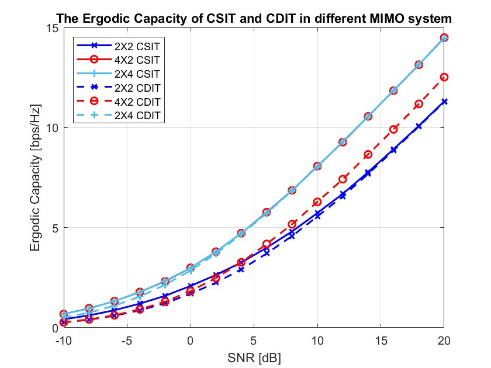
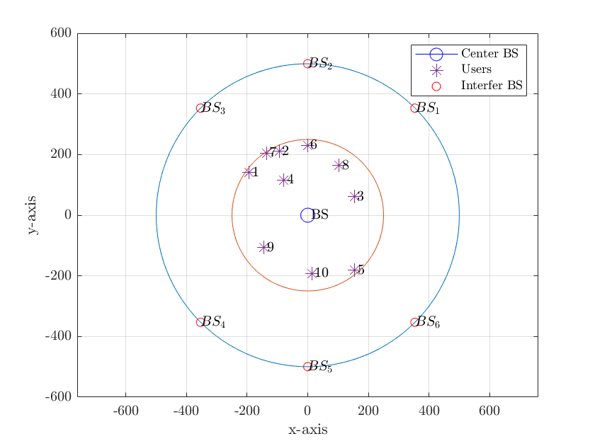
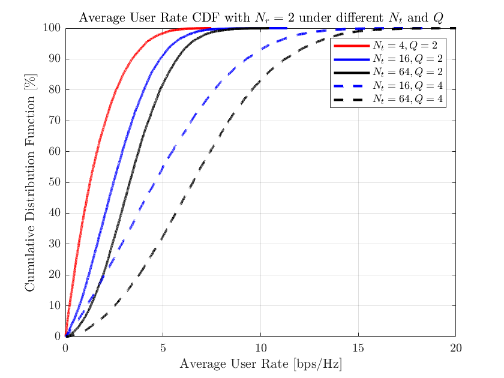
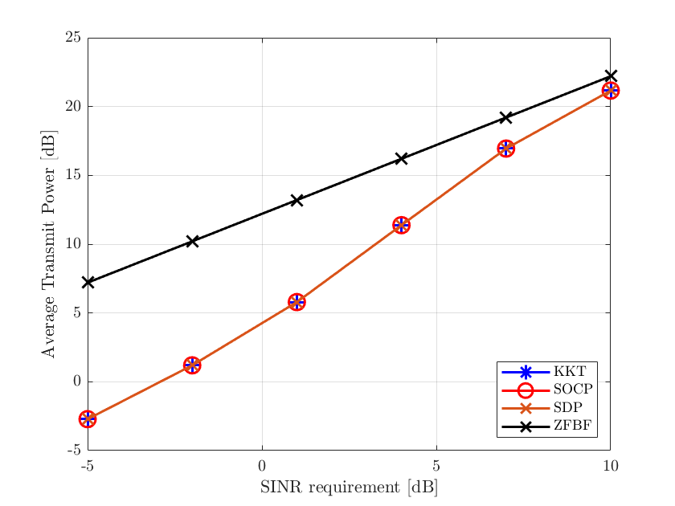
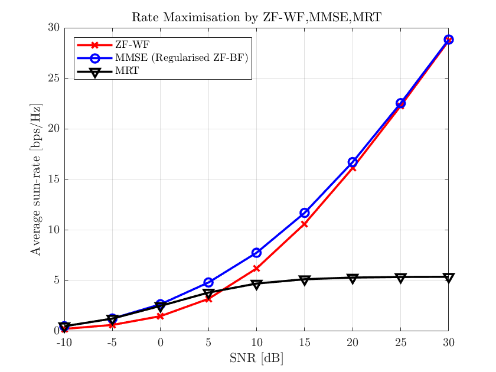
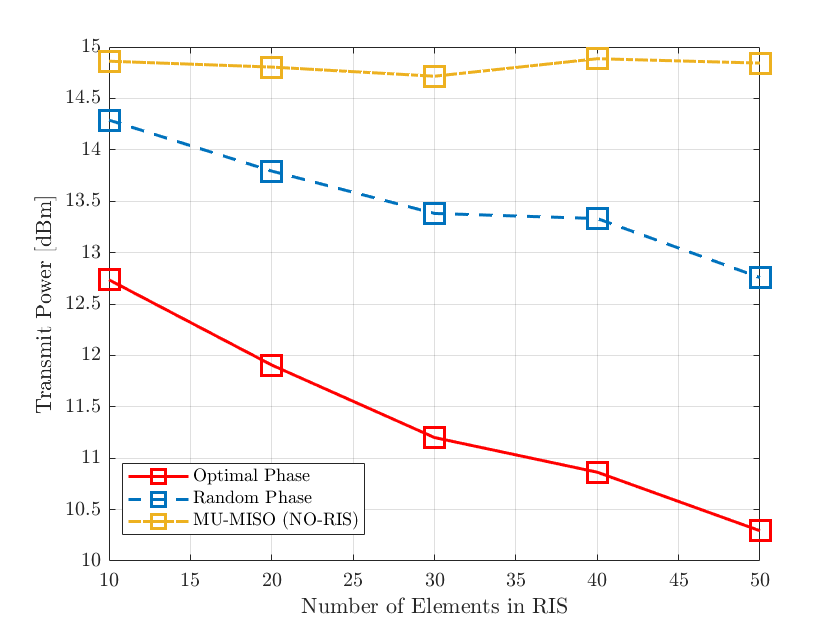

# RSMA Simulation and Wireless Communication Experiments

This repository contains MATLAB simulations for wireless communication and optimisation experiments. 

## Project Structure

| Folder | Contents |
| --- | --- |
| `practice/` | Water-filling practice implementation used to explore power allocation across parallel channels. |
| `cw1-mimo-capacity-and-ber/` | MIMO capacity, water-filling, QPSK link simulations, and BER comparisons across SISO, SIMO, MISO, and MIMO configurations. |
| `cw2-massive-mimo-simulation/` | Massive MIMO simulations covering random user deployment, long-term SINR, channel time correlation, scheduling, zero-forcing beamforming, and block diagonalisation experiments. |
| `cw3-beamforming-and-ris-optimisation/` | Beamforming and RIS-aided optimisation experiments using KKT, SDP, SOCP, WMMSE, and zero-forcing/water-filling methods. |

## Result Gallery

### MIMO Capacity and BER




### Massive MIMO Simulation






### Beamforming and RIS Optimisation







## Running the Simulations

Open MATLAB from the repository root and add the relevant source folders before running an experiment script. For example:

```matlab
addpath(genpath("cw1-mimo-capacity-and-ber"));
run("cw1-mimo-capacity-and-ber/main.m");
```

For the massive MIMO and optimisation experiments, use the corresponding top-level scripts inside `cw2-massive-mimo-simulation/legacy`, `cw2-massive-mimo-simulation/latest`, or `cw3-beamforming-and-ris-optimisation/`.

## Privacy Notes

This repository is prepared for public sharing. It does not include personal reports, coursework PDFs, lecture notes, compressed submission files, document exports, or private identifiers. MATLAB comments have been cleaned so that author metadata uses `Claudio Dong`.
